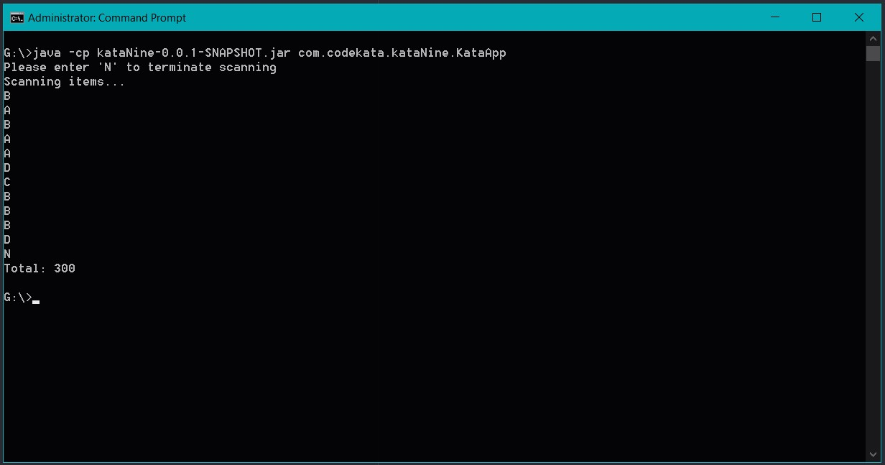

# [Kata09: Back to the Checkout](http://codekata.com/kata/kata09-back-to-the-checkout/)

## Table of Contents

- _[Description](#description)_
- _[Architecture](#architecture)_
- _[Usage](#usage)_
- _[Test-driven development](#test-driven-development)_
- _[Code](#code)_
- _[Technologies Used](#technologies-used)_

## Description:

- Refer [CodeKata](http://codekata.com/kata/kata09-back-to-the-checkout/) for the complete Problem Description
- Summary of problem

  - Individual letters of the alphabet (A, B, C, and so on) are used to identify goods/items in a store.
  - Goods are priced individually.
  - In addition, some items are multi-priced: buy n of them, and they'll cost you y cents. (Eg: item 'A' might cost 50 cents individually. But, buy three 'A's and they'll cost you $1.30).
  - checkout accepts items in any order. So that if we scan a B, an A, and another B, we'll recognize the two B's and price them at 45 (for a total price so far of 95).
  - Because the pricing changes frequently, we need to be able to pass in a set of pricing rules each time we start handling a checkout transaction.
  - This week's prices are as follows:
```
  Item   Unit Price      Special Price
  -------------------------------------
    A      50             3 for 130
    B      30             2 for 45
    C      20
    D      15
```

## Architecture
```
kata-09
├───images
├───pom.xml
├───README.md
├───src
│   ├───main
│   │   └───java
│   │       └───com.codekata.kataNine
│   │       │       ├───CheckOut.java
│   │       │       └───KataApp.java      <-- uses KataNineUtil to set up CheckOut
│   │       │
│   │       ├───com.codekata.model
│   │       │       └───PricingRule.java
│   │       │
│   │       └───com.codekata.util
│   │               └───KataNineUtil.java <-- define pricing rules here
│   │
│   └───test
│       └───java
│           └───com.codekata.kataNine
│                   └───CheckOutTest.java
│
└───target
    └───kataNine-0.0.1-SNAPSHOT.jar
```

## Usage

- Download the jar file from [here](https://github.com/shivavamsi/kata-09/blob/master/target/kataNine-0.0.1-SNAPSHOT.jar?raw=true).
- Navigate to the directory where the jar file is downloaded in terminal.
- Start the application using the code `java -cp kataNine-0.0.1-SNAPSHOT.jar com.codekata.kataNine.KataApp`

## Test-driven development
- Set of JUnit tests for CheckOut.java can be found [here](https://raw.githubusercontent.com/shivavamsi/kata-09/master/src/test/java/com/codekata/kataNine/CheckOutTest.java).
- The `@BeforeEach` method is used to initialize the CheckOut object.
- items are added to the cart using the scanItem() method and the actual and expected totals are compared.

## Code
- Different pricing rules can be defined by instantiating the PricingRule.java class
- KataNineUtil.java is used to define unit pricing and special pricing rules.
- A Screenshot of the interface for the checkout is shown below
  

### _Technologies Used:_

- _Java 8_
- _Maven_
- _JUnit 5_
- _Eclipse IDE_
