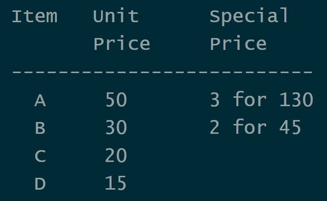

# [Kata09: Back to the Checkout](http://codekata.com/kata/kata09-back-to-the-checkout/)

## Description:

- Refer [CodeKata](http://codekata.com/kata/kata09-back-to-the-checkout/) for complete Problem Description
- Summary of problem

  - Individual letters of the alphabet (A, B, C, and so on) are used to identify goods/items in the store.
  - Goods are priced individually.
  - In addition, some items are multi-priced: buy n of them, and they'll cost you y cents. (Eg: item 'A' might cost 50 cents individually. But, buy three 'A's and they'll cost you $1.30).
  - This week's prices are as follows: 
  - checkout accepts items in any order. So that if we scan a B, an A, and another B, we'll recognize the two B's and price them at 45 (for a total price so far of 95).
  - Because the pricing changes frequently, we need to be able to pass in a set of pricing rules each time we start handling a checkout transaction.

## Usage

- Download the jar file from [here](target/kataNine-0.0.1-SNAPSHOT.jar).
- Use terminal and navigate to the directory where the jar file is located.
- Start the application using the code `java -cp kataNine-0.0.1-SNAPSHOT.jar com.codekata.kataNine.KataApp`

## Code

### _Technologies Used:_

- _Java 8_
- _Maven_
- _JUnit 5_
- _Eclipse IDE_
